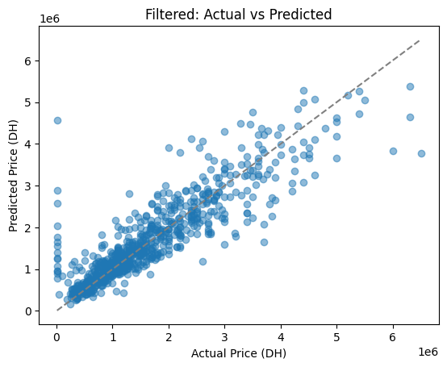

# Preprocessing 
after preprocessing the data scrapped from Mubawab website, here's a snippet of the .xlsx file obtained : 
( you can see more about scraping in a separate repo here [Web-Scraping-Mubawab.ma](https://github.com/rabio10/Web-Scraping-Mubawab.ma)

## This is the features (X)

|   surface_m2 |   nbr_pieces |   nbr_chambres |   nbr_bains |    lats |    longs |   etage_num | quartier_Ain Borja   | quartier_Ain Chock   | quartier_Ain Diab   | quartier_Ain Diab Extension   | quartier_Al Ahd Al Jadid   | quartier_Al Azhar   | quartier_Al Farah Dar Essalam   | quartier_Al Hadika   | quartier_Al Hassania   | quartier_Al Madina Aljadida   | quartier_Al Osra   | quartier_Al Qods   | quartier_Almaz   | quartier_Alsace Lorraine   | quartier_Anassi   | quartier_Ancienne Medina   | quartier_Anfa   | quartier_Anfa Supérieur   | quartier_Aïn Sebaâ   | quartier_Beausite   | quartier_Beauséjour   | quartier_Belvédère   | quartier_Benjdia   | quartier_Bernoussi   | quartier_Biranzarane   | quartier_Bouchentouf   | quartier_Bourgogne Est   | quartier_Bourgogne Ouest   | quartier_Bournazil   | quartier_Bouskoura Ville   | quartier_Burger   | quartier_CIL (Hay Salam)   | quartier_Californie   | quartier_Casablanca   | quartier_Casablanca Finance City   | quartier_Casablanca Marina   | quartier_Centre Ville   | quartier_Chaâbi   | quartier_City Dar Es Salaam   | quartier_Dar Bouazza   | quartier_Dar Lamane   | quartier_Dar Touzani   | quartier_Derb Abdellah   | quartier_Derb Al Youssofia   | quartier_Derb Carlotti   | quartier_Derb Chorfa   | quartier_Derb Ghalef   | quartier_Derb Khalid   | quartier_Derb Koréa   | quartier_Derb Lahjar   | quartier_Derb Loubila   | quartier_Derb Milan (Hay Omar Bnou Alkhattab)   | quartier_Derb Omar   | quartier_El Manar - El Hank   | quartier_El Mansouria   | quartier_Errahma   | quartier_Ferme Bretonne (Hay Arraha)   | quartier_Foncière   | quartier_Franceville   | quartier_Garage Allal   | quartier_Gauthier   | quartier_Golf de Benslimane   | quartier_Habbous   | quartier_Had Soualem   | quartier_Hay Adil   | quartier_Hay Al Amal   | quartier_Hay Al Fadl   | quartier_Hay Al Fath   | quartier_Hay Al Qods   | quartier_Hay Alamal   | quartier_Hay Albaraka   | quartier_Hay Alfalah   | quartier_Hay Alfarah   | quartier_Hay Alhoda   | quartier_Hay Almasjid   | quartier_Hay Almassira 2   | quartier_Hay Almassira 3   | quartier_Hay Annour   | quartier_Hay Antaria   | quartier_Hay Arrahma   | quartier_Hay Arsalan   | quartier_Hay Chifa   | quartier_Hay Chrifa   | quartier_Hay Haddaouia   | quartier_Hay Hakam   | quartier_Hay Hassani   | quartier_Hay Idrissia   | quartier_Hay Inara   | quartier_Hay Lmkansa   | quartier_Hay M'barka   | quartier_Hay Mohammadi   | quartier_Hay Moulay Abdellah   | quartier_Hay Moulay Rachid 1   | quartier_Hay Moulay Rachid 2   | quartier_Hay Moulay Rachid 3   | quartier_Hay Moulay Rachid 4   | quartier_Hay Palestine   | quartier_Hay Rajaa   | quartier_Hay Sadri   | quartier_Hay Salama   | quartier_Hay Smara   | quartier_Hay Tarik   | quartier_Hay Tasahol   | quartier_Hay Tissir   | quartier_Hay Zobir   | quartier_Hay salam   | quartier_Hermitage   | quartier_Ifriquia   | quartier_Itissal   | quartier_Jamila 2   | quartier_Jamila 3   | quartier_Jamila 5   | quartier_Jamila 6   | quartier_Jawadi   | quartier_La Floride   | quartier_La Gironde   | quartier_La Jonquiere   | quartier_La Vilette   | quartier_Lahraouiyine   | quartier_Laymoune   | quartier_Lekrimat   | quartier_Les Hôpitaux   | quartier_Les princesses   | quartier_Liberté   | quartier_Lissasfa   | quartier_Lusitania   | quartier_Mabroka   | quartier_Mandarona   | quartier_Mannesmann   | quartier_Maârif   | quartier_Maârif Extension   | quartier_Mers Sultan   | quartier_Michouar   | quartier_Moulay Youssef   | quartier_Médiouna   | quartier_Nassim 1   | quartier_Nassim 2   | quartier_Oasis   | quartier_Oasis sud   | quartier_Oulfa   | quartier_Palmier   | quartier_Plage Oued Cherrat   | quartier_Plateau   | quartier_Plateau (Al Batha)   | quartier_Polo   | quartier_Port   | quartier_Quartier Bachkou   | quartier_Quartier Cheminots   | quartier_Racine   | quartier_Racine Extension   | quartier_Riad El Ali   | quartier_Riviera   | quartier_Roches Noires   | quartier_Route de rabat   | quartier_Salmia 2   | quartier_Sidi Belyout   | quartier_Sidi El Khadir   | quartier_Sidi Hajjaj Oued Hassar   | quartier_Sidi Maarouf   | quartier_Sidi Maârouf   | quartier_Sidi Moumen   | quartier_Sidi Othmane   | quartier_Sidi Rahal   | quartier_Tacharouk (Hay Al Walaa)   | quartier_Tantonville   | quartier_Triangle d'Or   | quartier_Val Fleury   | quartier_Victoria   | quartier_Yasmina   | quartier_Zone Industrielle   | quartier_Zone Industrielle Moulay Rachid   | quartier_Zone Industrielle Oukacha   | etats_Bon état   | etats_Haut standing   | etats_Moyen standing   | etats_Nouveau   | etats_À rénover   |
|-------------:|-------------:|---------------:|------------:|--------:|---------:|------------:|:---------------------|:---------------------|:--------------------|:------------------------------|:---------------------------|:--------------------|:--------------------------------|:---------------------|:-----------------------|:------------------------------|:-------------------|:-------------------|:-----------------|:---------------------------|:------------------|:---------------------------|:----------------|:--------------------------|:---------------------|:--------------------|:----------------------|:---------------------|:-------------------|:---------------------|:-----------------------|:-----------------------|:-------------------------|:---------------------------|:---------------------|:---------------------------|:------------------|:---------------------------|:----------------------|:----------------------|:-----------------------------------|:-----------------------------|:------------------------|:------------------|:------------------------------|:-----------------------|:----------------------|:-----------------------|:-------------------------|:-----------------------------|:-------------------------|:-----------------------|:-----------------------|:-----------------------|:----------------------|:-----------------------|:------------------------|:------------------------------------------------|:---------------------|:------------------------------|:------------------------|:-------------------|:---------------------------------------|:--------------------|:-----------------------|:------------------------|:--------------------|:------------------------------|:-------------------|:-----------------------|:--------------------|:-----------------------|:-----------------------|:-----------------------|:-----------------------|:----------------------|:------------------------|:-----------------------|:-----------------------|:----------------------|:------------------------|:---------------------------|:---------------------------|:----------------------|:-----------------------|:-----------------------|:-----------------------|:---------------------|:----------------------|:-------------------------|:---------------------|:-----------------------|:------------------------|:---------------------|:-----------------------|:-----------------------|:-------------------------|:-------------------------------|:-------------------------------|:-------------------------------|:-------------------------------|:-------------------------------|:-------------------------|:---------------------|:---------------------|:----------------------|:---------------------|:---------------------|:-----------------------|:----------------------|:---------------------|:---------------------|:---------------------|:--------------------|:-------------------|:--------------------|:--------------------|:--------------------|:--------------------|:------------------|:----------------------|:----------------------|:------------------------|:----------------------|:------------------------|:--------------------|:--------------------|:------------------------|:--------------------------|:-------------------|:--------------------|:---------------------|:-------------------|:---------------------|:----------------------|:------------------|:----------------------------|:-----------------------|:--------------------|:--------------------------|:--------------------|:--------------------|:--------------------|:-----------------|:---------------------|:-----------------|:-------------------|:------------------------------|:-------------------|:------------------------------|:----------------|:----------------|:----------------------------|:------------------------------|:------------------|:----------------------------|:-----------------------|:-------------------|:-------------------------|:--------------------------|:--------------------|:------------------------|:--------------------------|:-----------------------------------|:------------------------|:------------------------|:-----------------------|:------------------------|:----------------------|:------------------------------------|:-----------------------|:-------------------------|:----------------------|:--------------------|:-------------------|:-----------------------------|:-------------------------------------------|:-------------------------------------|:-----------------|:----------------------|:-----------------------|:----------------|:------------------|
|           99 |            4 |              3 |           2 | 33.6104 | -7.48036 |           0 | False                | False                | False               | False                         | False                      | False               | False                           | False                | False                  | False                         | False              | False              | False            | False                      | False             | False                      | False           | False                     | False                | False               | False                 | False                | False              | True                 | False                  | False                  | False                    | False                      | False                | False                      | False             | False                      | False                 | False                 | False                              | False                        | False                   | False             | False                         | False                  | False                 | False                  | False                    | False                        | False                    | False                  | False                  | False                  | False                 | False                  | False                   | False                                           | False                | False                         | False                   | False              | False                                  | False               | False                  | False                   | False               | False                         | False              | False                  | False               | False                  | False                  | False                  | False                  | False                 | False                   | False                  | False                  | False                 | False                   | False                      | False                      | False                 | False                  | False                  | False                  | False                | False                 | False                    | False                | False                  | False                   | False                | False                  | False                  | False                    | False                          | False                          | False                          | False                          | False                          | False                    | False                | False                | False                 | False                | False                | False                  | False                 | False                | False                | False                | False               | False              | False               | False               | False               | False               | False             | False                 | False                 | False                   | False                 | False                   | False               | False               | False                   | False                     | False              | False               | False                | False              | False                | False                 | False             | False                       | False                  | False               | False                     | False               | False               | False               | False            | False                | False            | False              | False                         | False              | False                         | False           | False           | False                       | False                         | False             | False                       | False                  | False              | False                    | False                     | False               | False                   | False                     | False                              | False                   | False                   | False                  | False                   | False                 | False                               | False                  | False                    | False                 | False               | False              | False                        | False                                      | False                                | False            | False                 | False                  | True            | False             |
|          113 |            4 |              3 |           2 | 33.5287 | -7.61326 |           0 | False                | False                | False               | False                         | False                      | False               | False                           | False                | False                  | False                         | False              | False              | False            | False                      | False             | False                      | False           | False                     | False                | False               | False                 | False                | False              | False                | False                  | False                  | False                    | False                      | False                | False                      | False             | False                      | True                  | False                 | False                              | False                        | False                   | False             | False                         | False                  | False                 | False                  | False                    | False                        | False                    | False                  | False                  | False                  | False                 | False                  | False                   | False                                           | False                | False                         | False                   | False              | False                                  | False               | False                  | False                   | False               | False                         | False              | False                  | False               | False                  | False                  | False                  | False                  | False                 | False                   | False                  | False                  | False                 | False                   | False                      | False                      | False                 | False                  | False                  | False                  | False                | False                 | False                    | False                | False                  | False                   | False                | False                  | False                  | False                    | False                          | False                          | False                          | False                          | False                          | False                    | False                | False                | False                 | False                | False                | False                  | False                 | False                | False                | False                | False               | False              | False               | False               | False               | False               | False             | False                 | False                 | False                   | False                 | False                   | False               | False               | False                   | False                     | False              | False               | False                | False              | False                | False                 | False             | False                       | False                  | False               | False                     | False               | False               | False               | False            | False                | False            | False              | False                         | False              | False                         | False           | False           | False                       | False                         | False             | False                       | False                  | False              | False                    | False                     | False               | False                   | False                     | False                              | False                   | False                   | False                  | False                   | False                 | False                               | False                  | False                    | False                 | False               | False              | False                        | False                                      | False                                | False            | False                 | False                  | True            | False             |
|          122 |            4 |              3 |           2 | 33.5853 | -7.59893 |           2 | False                | False                | False               | False                         | False                      | False               | False                           | False                | False                  | False                         | False              | False              | False            | False                      | False             | False                      | False           | False                     | False                | False               | False                 | True                 | False              | False                | False                  | False                  | False                    | False                      | False                | False                      | False             | False                      | False                 | False                 | False                              | False                        | False                   | False             | False                         | False                  | False                 | False                  | False                    | False                        | False                    | False                  | False                  | False                  | False                 | False                  | False                   | False                                           | False                | False                         | False                   | False              | False                                  | False               | False                  | False                   | False               | False                         | False              | False                  | False               | False                  | False                  | False                  | False                  | False                 | False                   | False                  | False                  | False                 | False                   | False                      | False                      | False                 | False                  | False                  | False                  | False                | False                 | False                    | False                | False                  | False                   | False                | False                  | False                  | False                    | False                          | False                          | False                          | False                          | False                          | False                    | False                | False                | False                 | False                | False                | False                  | False                 | False                | False                | False                | False               | False              | False               | False               | False               | False               | False             | False                 | False                 | False                   | False                 | False                   | False               | False               | False                   | False                     | False              | False               | False                | False              | False                | False                 | False             | False                       | False                  | False               | False                     | False               | False               | False               | False            | False                | False            | False              | False                         | False              | False                         | False           | False           | False                       | False                         | False             | False                       | False                  | False              | False                    | False                     | False               | False                   | False                     | False                              | False                   | False                   | False                  | False                   | False                 | False                               | False                  | False                    | False                 | False               | False              | False                        | False                                      | False                                | False            | False                 | False                  | True            | False             |
|           99 |            4 |              2 |           2 | 33.5853 | -7.59893 |           5 | False                | False                | False               | False                         | False                      | False               | False                           | False                | False                  | False                         | False              | False              | False            | False                      | False             | False                      | False           | False                     | False                | False               | False                 | True                 | False              | False                | False                  | False                  | False                    | False                      | False                | False                      | False             | False                      | False                 | False                 | False                              | False                        | False                   | False             | False                         | False                  | False                 | False                  | False                    | False                        | False                    | False                  | False                  | False                  | False                 | False                  | False                   | False                                           | False                | False                         | False                   | False              | False                                  | False               | False                  | False                   | False               | False                         | False              | False                  | False               | False                  | False                  | False                  | False                  | False                 | False                   | False                  | False                  | False                 | False                   | False                      | False                      | False                 | False                  | False                  | False                  | False                | False                 | False                    | False                | False                  | False                   | False                | False                  | False                  | False                    | False                          | False                          | False                          | False                          | False                          | False                    | False                | False                | False                 | False                | False                | False                  | False                 | False                | False                | False                | False               | False              | False               | False               | False               | False               | False             | False                 | False                 | False                   | False                 | False                   | False               | False               | False                   | False                     | False              | False               | False                | False              | False                | False                 | False             | False                       | False                  | False               | False                     | False               | False               | False               | False            | False                | False            | False              | False                         | False              | False                         | False           | False           | False                       | False                         | False             | False                       | False                  | False              | False                    | False                     | False               | False                   | False                     | False                              | False                   | False                   | False                  | False                   | False                 | False                               | False                  | False                    | False                 | False               | False              | False                        | False                                      | False                                | False            | False                 | False                  | True            | False             |
|           96 |            4 |              3 |           2 | 33.6044 | -7.54197 |           0 | False                | False                | False               | False                         | False                      | False               | False                           | False                | False                  | False                         | False              | False              | False            | False                      | False             | False                      | False           | False                     | True                 | False               | False                 | False                | False              | False                | False                  | False                  | False                    | False                      | False                | False                      | False             | False                      | False                 | False                 | False                              | False                        | False                   | False             | False                         | False                  | False                 | False                  | False                    | False                        | False                    | False                  | False                  | False                  | False                 | False                  | False                   | False                                           | False                | False                         | False                   | False              | False                                  | False               | False                  | False                   | False               | False                         | False              | False                  | False               | False                  | False                  | False                  | False                  | False                 | False                   | False                  | False                  | False                 | False                   | False                      | False                      | False                 | False                  | False                  | False                  | False                | False                 | False                    | False                | False                  | False                   | False                | False                  | False                  | False                    | False                          | False                          | False                          | False                          | False                          | False                    | False                | False                | False                 | False                | False                | False                  | False                 | False                | False                | False                | False               | False              | False               | False               | False               | False               | False             | False                 | False                 | False                   | False                 | False                   | False               | False               | False                   | False                     | False              | False               | False                | False              | False                | False                 | False             | False                       | False                  | False               | False                     | False               | False               | False               | False            | False                | False            | False              | False                         | False              | False                         | False           | False           | False                       | False                         | False             | False                       | False                  | False              | False                    | False                     | False               | False                   | False                     | False                              | False                   | False                   | False                  | False                   | False                 | False                               | False                  | False                    | False                 | False               | False              | False                        | False                                      | False                                | False            | False                 | False                  | True            | False             |


## This is the Target (y)
|         price_DH |
|-----------------:|
| 935000           |
|      1.8667e+06  |
|      1.575e+06   |
|      1.15e+06    |
|      1.17564e+06 |


# Training a Regression model
## Regressor
Using `HistGradientBoostingRegressor`, we fitted X with y.
## Some extra cleaning
Before this we cleaned some outliers that affected the first training time.
## Evaluating results and accuracy
After outlier removal:
```
  R²   = 0.7832
  MSE  = 272,162,163,797.90
  RMSE = 521,691.64
  MAE  = 326,278.82
  ```
## Diagram of Actual vs Predicted prices


# Upcoming 
getting insights using the model and analyse housing in casablanca.
